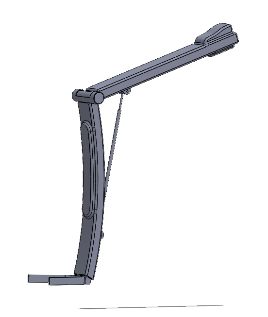

# ExoChair – Simscape/Simulink Model



## 🦾 Overview

**ExoChair** is a biomechanical assistive device modeled using **Simulink** and **Simscape Multibody**. It functions as a lower-limb exoskeleton chair that attaches to the user's legs, allowing them to "sit in the air" and get up again with minimal effort. The system is driven by actuators that replicate the knee flexion and extension needed for seated posture and standing up.

This project simulates the kinematics and dynamics of the ExoChair using physical modeling blocks and mechanical constraints to evaluate feasibility, comfort, and actuator performance.

## 🎯 Objectives

- Simulate a wearable robotic chair structure using Simscape Multibody
- Model human-exoskeleton interaction at the knee joint
- Implement an actuator system to support sit-to-stand and stand-to-sit transitions
- Validate system behavior in a realistic usage scenario

## ⚙️ Features

- Fully modeled 3D multibody system (legs + exochair)
- Adjustable seat position with joint constraints
- Pneumatic or electric actuator (parametrized)
- Sit/stand cycle triggered with user input signal
- Gravity, inertia, and joint torque effects included

## 🔍 Folder Structure

```
📁 ExoChair_Project/
├── PID_CONTROL_GRAVEDAD.slx           # Simulink main model
├── CAD MODEL           # Folder with all the parts
├── model.png           # 3D view of the model
├── demo.mp4            # Beta simulation video
└── README.md           # This file
```

## ▶️ Simulation Video

[](demo.mp4)

> Click the image above or [download the demo video](demo.mp4) to see the beta version in action.

## 📌 Dependencies

- MATLAB R2023b or later  
- Simulink  
- Simscape  
- Simscape Multibody  
- Simscape Driveline (if using torque-based actuators)

## 🚀 How to Run

1. Clone or download this repository:
   ```bash
   git clone https://github.com/yourusername/ExoChair.git
   cd ExoChair
   ```
2. Open `PID_CONTROL_GRAVEDAD.slx` in Simulink.
3. Press **Run** to simulate a full sit-stand cycle.
4. Use the simulation data inspector to analyze torque, angles, and energy.

## 📈 Future Improvements

- Add feedback-based control system (PID or fuzzy logic)
- Human-in-the-loop interface for wearable input
- Battery/power consumption analysis
- Real-time deployment on embedded hardware (e.g., Raspberry Pi, Arduino)

## 👨‍🔬 Author

**Héctor Gordillo**  

---

## 📚 References

This project is inspired by the concept of the **Chairless Chair**, and the 3D mechanical structure was partially based on a model available at:

- [Chairless Chair – GrabCAD](https://grabcad.com/library/chairless-chair-1)
